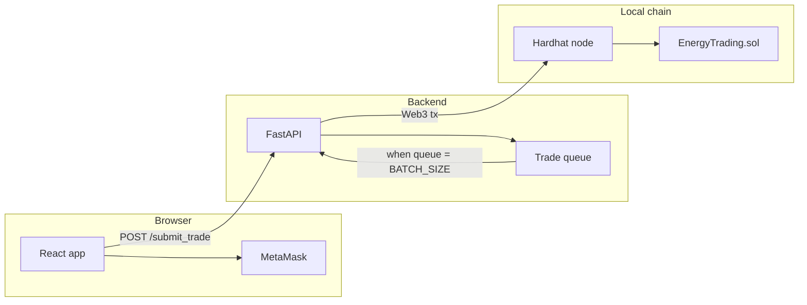

# Energy Trading (batched on-chain oracle demo)

Prosumer sells are validated off-chain, queued, and committed to Ethereum in batches via a Merkle root (gas-efficient anchor). This repo is a **demo slice**: one oracle signs `submitBatch`; it is not a full peer-to-peer order book.

## Architecture



## Prerequisites

- Node.js + npm (Hardhat + React)
- Python 3.10+ recommended
- MetaMask (recommended for wallet connect)

## MetaMask and Hardhat (chain 31337)

The API and Hardhat use **chain ID 31337** by default (`CHAIN_ID` in `.env`).

**Option A — from the UI**

1. Open the React app.
2. Click **“Add / switch Hardhat (31337) in MetaMask”** (uses `wallet_addEthereumChain` / `wallet_switchEthereumChain`).
3. RPC URL defaults to `http://127.0.0.1:8545`. Override with `REACT_APP_HARDHAT_RPC_URL` if your node listens elsewhere.

**Option B — manually in MetaMask**

- **Network name:** Hardhat Local (any label)
- **RPC URL:** `http://127.0.0.1:8545`
- **Chain ID:** `31337`
- **Currency symbol:** ETH

If the wallet chain does not match the API, the app shows an orange warning. The demo does not require you to *send* txs from the browser, but matching the network avoids confusion.

## Clearing stuck dev servers (ports)

If you see **“address already in use”** for ports **3000**, **3001**, **8000**, **8002**, or **8545**, stop old processes from the **repo root**:

```powershell
npm run stop:dev
```

Then start **Hardhat → deploy → API → client** again in a clean order.

## `.env` and `CONTRACT_ADDRESS`

1. Copy **`.env.example`** to **`.env`** (never commit `.env`).
2. Run **`npm run deploy:local`** while **`npm run node`** is running.
3. Copy the printed **`CONTRACT_ADDRESS`** into **`.env`** exactly.

**When the address changes**

- You restarted **`npm run node`** with a **new/empty** chain state, or  
- You deployed **again** (higher nonce → **new contract address**).

If **`.env` still has an old address**, you will see API startup errors (**“No contract bytecode”**) or **on-chain failures**. Fix by redeploying and **pasting the new address** into **`.env`**, then **restart uvicorn** so it reloads the file.

The same notes are in **`.env.example`** next to `CONTRACT_ADDRESS`.

## One-time setup

### 1. Root (contracts)

```powershell
cd "path\to\Energy-trader-main"
npm install
npm run compile
```

### 2. Python API

```powershell
python -m venv .venv
.\.venv\Scripts\Activate.ps1
pip install -r requirements.txt
```

### 3. Environment file

```powershell
Copy-Item .env.example .env
```

- `PRIVATE_KEY` must be **Hardhat account #0** (same key printed when you run `npm run node`).
- Set `CONTRACT_ADDRESS` from **`npm run deploy:local`** output (see above).

### 4. React client

```powershell
cd client
npm install
```

Optional **Create React App** env vars (set when running `npm start`):

| Variable | Purpose |
|----------|---------|
| `REACT_APP_API_URL` | API base (default `http://127.0.0.1:8000`) |
| `REACT_APP_HARDHAT_RPC_URL` | RPC shown to MetaMask (default `http://127.0.0.1:8545`) |
| `REACT_APP_CHAIN_ID` | Expected chain id for labels (default `31337`; live value still comes from **`GET /status`** `chain_id`) |

## Run the full demo (three terminals)

**Terminal A — local blockchain**

```powershell
cd "path\to\Energy-trader-main"
npm run node
```

**Terminal B — deploy contract (once per fresh chain)**

```powershell
cd "path\to\Energy-trader-main"
npm run deploy:local
```

Put the printed `CONTRACT_ADDRESS` into `.env`, then start the API:

```powershell
.\.venv\Scripts\Activate.ps1
uvicorn app:app --reload --host 127.0.0.1 --port 8000
```

**Terminal C — frontend**

```powershell
cd "path\to\Energy-trader-main\client"
npm start
```

Open [http://localhost:3000](http://localhost:3000). Submit enough valid trades to fill the queue (**`batch_size`** from **`GET /status`**, default 5); the API submits one on-chain transaction and the UI shows the **tx hash** under “Last on-chain batch”.

## Verify contracts

```powershell
npm run test
```

## API notes

- `POST /submit_trade` body: `{ "seller": "<checksum 0x address>", "amount": <int>, "type": "OG (Solar)" | "ES (Battery)" }`
- Validation errors return **422** with `{ "error": "validation_error", "detail": [...] }`.
- `GET /status` returns `queue_size`, **`batch_size`**, **`chain_id`**, and `last_batch` (`tx_hash`, `trade_count`, `total_value_wei`, `error`, `submitted_at`).

## Security

Never commit `.env` or real private keys. The sample key in `.env.example` is the **public Hardhat default** for local development only.

## Limitations (future work)

Peer-to-peer matching, consumer bids, ML load forecasting, and trustless oracles are out of scope for this demo; see report/slides for an honest scope statement.
